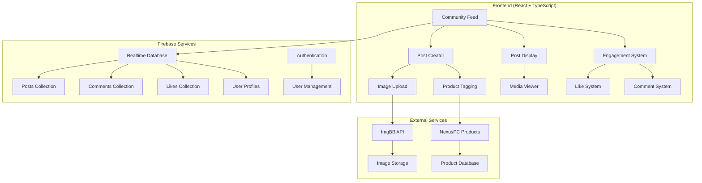

# Design Document: Community Posts

## Overview

The Community Posts feature transforms NexusPC into a social platform where users can share product discoveries, tech experiences, and engage through likes and comments. The system leverages the existing Firebase Realtime Database infrastructure and integrates seamlessly with the current authentication and chat systems.

The design follows a feed-based architecture similar to Facebook or Instagram, with real-time updates, infinite scroll, and rich media support. Posts can include text content, multiple images, and tagged products from the NexusPC database, creating a comprehensive community experience for PC enthusiasts.

## Architecture

### High-Level Architecture



### Database Schema Design

The system uses Firebase Realtime Database with the following structure:

```
firebase/
├── posts/
│   └── {postId}/
│       ├── authorId: string
│       ├── content: string
│       ├── images: string[] (ImgBB URLs)
│       ├── taggedProducts: ProductReference[]
│       ├── privacy: "public" | "friends" | "private"
│       ├── createdAt: timestamp
│       ├── editedAt?: timestamp
│       ├── likeCount: number
│       └── commentCount: number
├── comments/
│   └── {postId}/
│       └── {commentId}/
│           ├── authorId: string
│           ├── content: string
│           ├── parentId?: string (for replies)
│           ├── createdAt: timestamp
│           ├── editedAt?: timestamp
│           └── mentions: string[] (user IDs)
├── likes/
│   └── {postId}/
│       └── {userId}: timestamp
├── reactions/
│   └── {postId}/
│       └── {reactionType}/
│           └── {userId}: timestamp
├── userFollows/
│   └── {userId}/
│       ├── following/
│       │   └── {followedUserId}: timestamp
│       └── followers/
│           └── {followerId}: timestamp
├── userFeed/
│   └── {userId}/
│       └── {postId}: timestamp (for personalized feeds)
└── notifications/
    └── {userId}/
        └── {notificationId}/
            ├── type: string
            ├── fromUserId: string
            ├── postId?: string
            ├── commentId?: string
            ├── createdAt: timestamp
            └── read: boolean
```

### Feed Algorithm Design

The feed system implements a hybrid approach combining chronological and engagement-based sorting:

1. **Primary Feed**: Posts from followed users (chronological)
2. **Discovery Feed**: Popular posts from all users (engagement-weighted)
3. **Personalized Ranking**: Based on user interaction history

## Components and Interfaces

### Core Components

#### PostCreator Component
```typescript
interface PostCreatorProps {
  onPostCreated: (post: Post) => void;
  initialContent?: string;
  taggedProducts?: ProductReference[];
}

interface PostCreatorState {
  content: string;
  images: File[];
  taggedProducts: ProductReference[];
  privacy: PostPrivacy;
  isSubmitting: boolean;
}
```

**Features:**
- Rich text editor with character limit (5000)
- Drag-and-drop image upload (max 10 images, 10MB each)
- Product search and tagging from NexusPC database
- Privacy settings selector
- Real-time character count and validation

#### CommunityFeed Component
```typescript
interface CommunityFeedProps {
  feedType: 'following' | 'discover' | 'user';
  userId?: string; // for user-specific feeds
  filters?: FeedFilters;
}

interface FeedFilters {
  postType?: 'all' | 'product' | 'media';
  timeRange?: 'day' | 'week' | 'month' | 'all';
  sortBy?: 'recent' | 'popular' | 'trending';
}
```

**Features:**
- Infinite scroll with intersection observer
- Real-time post updates via Firebase listeners
- Skeleton loading states
- Pull-to-refresh functionality
- Filter and sort options

#### PostCard Component
```typescript
interface PostCardProps {
  post: Post;
  currentUser: User;
  onLike: (postId: string) => void;
  onComment: (postId: string, content: string) => void;
  onShare: (postId: string) => void;
}
```

**Features:**
- Responsive image gallery with lightbox
- Engagement buttons (like, comment, share)
- Tagged product display with pricing
- Relative timestamps with auto-updates
- Context menu for post actions

#### CommentSystem Component
```typescript
interface CommentSystemProps {
  postId: string;
  comments: Comment[];
  onAddComment: (content: string, parentId?: string) => void;
  onEditComment: (commentId: string, content: string) => void;
  onDeleteComment: (commentId: string) => void;
}
```

**Features:**
- Threaded comments (3 levels deep)
- @mention support with autocomplete
- Edit/delete functionality with time limits
- Real-time comment updates
- Pagination for large comment threads

### Service Layer

#### PostService
```typescript
class PostService {
  async createPost(postData: CreatePostRequest): Promise<Post>
  async updatePost(postId: string, updates: Partial<Post>): Promise<void>
  async deletePost(postId: string): Promise<void>
  async getPost(postId: string): Promise<Post | null>
  async getUserPosts(userId: string, limit?: number): Promise<Post[]>
  async getFeedPosts(userId: string, feedType: FeedType, limit?: number): Promise<Post[]>
  async searchPosts(query: string, filters?: SearchFilters): Promise<Post[]>
}
```

#### EngagementService
```typescript
class EngagementService {
  async likePost(postId: string, userId: string): Promise<void>
  async unlikePost(postId: string, userId: string): Promise<void>
  async reactToPost(postId: string, userId: string, reaction: ReactionType): Promise<void>
  async addComment(postId: string, comment: CreateCommentRequest): Promise<Comment>
  async updateComment(commentId: string, content: string): Promise<void>
  async deleteComment(commentId: string): Promise<void>
  async getPostLikes(postId: string): Promise<Like[]>
  async getPostComments(postId: string, limit?: number): Promise<Comment[]>
}
```

#### NotificationService
```typescript
class NotificationService {
  async createNotification(notification: CreateNotificationRequest): Promise<void>
  async getUserNotifications(userId: string, limit?: number): Promise<Notification[]>
  async markAsRead(notificationId: string): Promise<void>
  async markAllAsRead(userId: string): Promise<void>
  async deleteNotification(notificationId: string): Promise<void>
}
```

## Data Models

### Core Data Types

```typescript
interface Post {
  id: string;
  authorId: string;
  content: string;
  images: string[]; // ImgBB URLs
  taggedProducts: ProductReference[];
  privacy: PostPrivacy;
  createdAt: number;
  editedAt?: number;
  likeCount: number;
  commentCount: number;
  reactionCounts: Record<ReactionType, number>;
}

interface Comment {
  id: string;
  postId: string;
  authorId: string;
  content: string;
  parentId?: string; // for nested replies
  createdAt: number;
  editedAt?: number;
  mentions: string[]; // mentioned user IDs
  likeCount: number;
}

interface ProductReference {
  productId: string;
  title: string;
  imageUrl: string;
  price: number;
  retailer: string;
  category: string;
}

interface Like {
  userId: string;
  postId?: string;
  commentId?: string;
  createdAt: number;
}

interface Reaction {
  userId: string;
  postId: string;
  type: ReactionType;
  createdAt: number;
}

interface Notification {
  id: string;
  userId: string;
  type: NotificationType;
  fromUserId: string;
  postId?: string;
  commentId?: string;
  createdAt: number;
  read: boolean;
  message: string;
}

type PostPrivacy = 'public' | 'friends' | 'private';
type ReactionType = 'like' | 'love' | 'wow' | 'helpful' | 'inspiring';
type NotificationType = 'like' | 'comment' | 'mention' | 'follow' | 'reaction';
```

### Integration Types

```typescript
interface CreatePostRequest {
  content: string;
  images: File[];
  taggedProducts: ProductReference[];
  privacy: PostPrivacy;
}

interface CreateCommentRequest {
  postId: string;
  content: string;
  parentId?: string;
  mentions: string[];
}

interface FeedQuery {
  userId: string;
  feedType: 'following' | 'discover' | 'user';
  limit: number;
  startAfter?: string; // for pagination
  filters?: FeedFilters;
}
```

## Error Handling

### Error Types and Recovery

```typescript
enum PostErrorType {
  CONTENT_TOO_LONG = 'CONTENT_TOO_LONG',
  IMAGE_TOO_LARGE = 'IMAGE_TOO_LARGE',
  TOO_MANY_IMAGES = 'TOO_MANY_IMAGES',
  INVALID_PRODUCT_TAG = 'INVALID_PRODUCT_TAG',
  PERMISSION_DENIED = 'PERMISSION_DENIED',
  NETWORK_ERROR = 'NETWORK_ERROR',
  RATE_LIMITED = 'RATE_LIMITED'
}

class PostError extends Error {
  constructor(
    public type: PostErrorType,
    public message: string,
    public retryable: boolean = false
  ) {
    super(message);
  }
}
```

### Error Handling Strategies

1. **Validation Errors**: Show inline validation messages with specific guidance
2. **Network Errors**: Implement retry logic with exponential backoff
3. **Permission Errors**: Redirect to appropriate authentication flow
4. **Rate Limiting**: Show cooldown timer and queue actions
5. **Image Upload Failures**: Allow individual image retry without losing other content

### Offline Support

```typescript
interface OfflinePostQueue {
  pendingPosts: PendingPost[];
  pendingComments: PendingComment[];
  pendingLikes: PendingLike[];
}

interface PendingPost {
  id: string;
  content: string;
  images: File[];
  taggedProducts: ProductReference[];
  privacy: PostPrivacy;
  createdAt: number;
  retryCount: number;
}
```

**Offline Behavior:**
- Queue posts, comments, and likes when offline
- Show "pending" status with retry options
- Auto-sync when connection restored
- Conflict resolution for simultaneous edits

## Testing Strategy

### Unit Testing Approach

The testing strategy combines traditional unit tests for specific functionality with property-based tests for universal behaviors, ensuring comprehensive coverage of the community posts system.

**Unit Tests Focus Areas:**
- Component rendering and user interactions
- Service layer API calls and error handling
- Data validation and transformation
- Edge cases like empty states and error conditions
- Integration points between components

**Property-Based Tests Focus Areas:**
- Universal properties that must hold across all valid inputs
- Data consistency and integrity rules
- Performance characteristics under various loads
- Security and permission validation

### Testing Framework Configuration

**Unit Testing Stack:**
- **Framework**: Jest + React Testing Library
- **Coverage Target**: 85% line coverage minimum
- **Mock Strategy**: Mock Firebase services and external APIs
- **Test Organization**: Co-located with components using `.test.tsx` suffix

**Property-Based Testing Stack:**
- **Framework**: fast-check (JavaScript property testing library)
- **Test Configuration**: Minimum 100 iterations per property test
- **Generator Strategy**: Custom generators for Post, Comment, and User data
- **Integration**: Property tests run alongside unit tests in Jest

### Property Test Configuration

Each property-based test must:
- Run minimum 100 iterations to ensure statistical significance
- Include a comment referencing the design document property
- Use the tag format: **Feature: community-posts, Property {number}: {property_text}**
- Generate realistic test data that respects business constraints

Example property test structure:
```typescript
// Feature: community-posts, Property 1: Post creation preserves content
describe('Post Creation Properties', () => {
  it('should preserve content through create-read cycle', () => {
    fc.assert(fc.property(
      postContentGenerator(),
      (content) => {
        const post = createPost({ content, /* other fields */ });
        const retrieved = getPost(post.id);
        return retrieved.content === content;
      }
    ), { numRuns: 100 });
  });
});
```

## Correctness Properties

*A property is a characteristic or behavior that should hold true across all valid executions of a system—essentially, a formal statement about what the system should do. Properties serve as the bridge between human-readable specifications and machine-verifiable correctness guarantees.*

Based on the prework analysis and property reflection to eliminate redundancy, the following correctness properties must be validated through property-based testing:

### Property 1: Post Content Validation
*For any* post creation request, the system should reject posts with content exceeding 5000 characters or images exceeding 10MB, and accept all valid posts within these limits
**Validates: Requirements 1.4**

### Property 2: Post Metadata Consistency
*For any* created post, it should contain authorId, timestamp, and content metadata, and editing should preserve createdAt while updating editedAt
**Validates: Requirements 1.5, 1.9**

### Property 3: Post Privacy Enforcement
*For any* post with privacy settings, only authorized users should be able to view the post based on its privacy level (public, friends, private)
**Validates: Requirements 1.6**

### Property 4: Post Author Permissions
*For any* post, the author should be able to edit within 24 hours and delete at any time, while non-authors should not have these permissions
**Validates: Requirements 1.7, 1.8**

### Property 5: Feed Chronological Ordering
*For any* set of posts in a feed, they should be displayed in reverse chronological order based on creation timestamp
**Validates: Requirements 2.1**

### Property 6: Post Display Completeness
*For any* displayed post, it should show author avatar, name, timestamp, content, and appropriate engagement metrics
**Validates: Requirements 2.2, 2.7**

### Property 7: Image Display Consistency
*For any* post containing images, the system should display thumbnails with lightbox functionality and arrange multiple images in a responsive grid
**Validates: Requirements 2.3, 2.6**

### Property 8: Feed Pagination Behavior
*For any* feed scroll operation, exactly 20 posts should be loaded at a time when reaching the scroll threshold
**Validates: Requirements 2.5**

### Property 9: Like System Consistency
*For any* user-post combination, liking should increment count and store the like, unliking should decrement count and remove the like, and users should not be able to like their own posts
**Validates: Requirements 3.1, 3.2, 3.3, 3.4**

### Property 10: Reaction System Integrity
*For any* user-post reaction, only one reaction per user should be stored, reaction counts should be grouped by type, and reaction changes should update counts correctly
**Validates: Requirements 3.6, 3.7, 3.8**

### Property 11: Comment Validation and Display
*For any* comment submission, content should be validated against 1000 character limit, and valid comments should display immediately with author info and timestamp
**Validates: Requirements 4.2, 4.3**

### Property 12: Comment Threading Limits
*For any* comment thread, replies should be supported up to 3 levels deep but not beyond, maintaining proper parent-child relationships
**Validates: Requirements 4.4**

### Property 13: Comment Author Permissions
*For any* comment, the author should be able to edit within 15 minutes and delete at any time, while maintaining proper deletion placeholders for comments with replies
**Validates: Requirements 4.6, 4.7, 4.8**

### Property 14: Comment Pagination Consistency
*For any* post with comments, initially 10 comments should be displayed with load-more functionality for additional comments
**Validates: Requirements 4.9**

### Property 15: Mention and Notification System
*For any* comment containing @mentions, mentioned users should receive notifications, and the mention should be properly stored and linked
**Validates: Requirements 4.10**

### Property 16: Product Integration Completeness
*For any* product post, it should display current price, availability, retailer information, and provide direct purchase links
**Validates: Requirements 5.2, 5.5**

### Property 17: Product Rating System
*For any* shared product, users should be able to rate on a 1-5 star scale, and average community ratings should be calculated and displayed correctly
**Validates: Requirements 5.6, 5.7**

### Property 18: Content Moderation Accessibility
*For any* post or comment, a report button should be available, and reports should be collected with reasons and forwarded to moderation queue
**Validates: Requirements 6.1, 6.2**

### Property 19: Automated Content Flagging
*For any* post containing prohibited keywords or excessive profanity, it should be automatically flagged and hidden pending review
**Validates: Requirements 6.5**

### Property 20: User Blocking Effectiveness
*For any* blocked user relationship, the blocked user's content should not appear in the blocking user's feed or interactions
**Validates: Requirements 6.7**

### Property 21: Follow System Integrity
*For any* follow action, it should update follower/following lists correctly, and unfollowing should remove the relationship properly
**Validates: Requirements 7.2**

### Property 22: Feed Prioritization Logic
*For any* user's feed, posts from followed users should appear with higher priority than posts from non-followed users
**Validates: Requirements 7.3**

### Property 23: Profile Statistics Accuracy
*For any* user profile, displayed counts for posts, followers, and following should match actual database counts
**Validates: Requirements 7.4**

### Property 24: Private Profile Access Control
*For any* private user profile, non-approved followers should not be able to view posts, and follow requests should be required for access
**Validates: Requirements 7.6, 7.7**

### Property 25: Search Functionality Completeness
*For any* search query, results should include matches from post content, tags, and product names, with proper keyword highlighting and grouping by post type
**Validates: Requirements 8.1, 8.2, 8.6**

### Property 26: Search Filtering Accuracy
*For any* search with filters applied, results should only include posts matching the specified post type, date range, and user criteria
**Validates: Requirements 8.3**

### Property 27: Notification Generation Consistency
*For any* engagement action (like, comment, reply, mention, follow), appropriate notifications should be generated for the relevant users in real-time
**Validates: Requirements 9.1, 9.2, 9.3, 9.7**

### Property 28: Notification Grouping Logic
*For any* series of similar notifications, they should be grouped together to prevent spam while maintaining individual notification details
**Validates: Requirements 9.4**

### Property 29: Notification Read Status Management
*For any* notification, viewing the related content should mark the notification as read, and the notification center should accurately reflect read/unread status
**Validates: Requirements 9.8, 9.9**

## Testing Strategy

### Dual Testing Approach

The Community Posts system requires both unit tests and property-based tests to ensure comprehensive coverage and correctness validation.

**Unit Tests Focus:**
- Component rendering and user interaction flows
- Service layer API integration and error handling
- Specific edge cases like empty states and error conditions
- Integration between Firebase services and React components
- Image upload and product tagging functionality

**Property-Based Tests Focus:**
- Universal properties that must hold across all valid inputs
- Data consistency and integrity across the entire system
- Permission and security validation under various scenarios
- Performance characteristics with different data loads

### Property-Based Testing Configuration

**Framework**: fast-check (JavaScript property testing library)
**Minimum Iterations**: 100 per property test
**Test Tagging**: Each property test must include a comment with the format:
```
// Feature: community-posts, Property {number}: {property description}
```

**Custom Generators Required:**
- `postGenerator()`: Creates valid Post objects with realistic content
- `userGenerator()`: Creates User objects with proper authentication data
- `commentGenerator()`: Creates Comment objects with proper threading
- `productGenerator()`: Creates ProductReference objects from NexusPC database
- `engagementGenerator()`: Creates Like and Reaction objects with proper relationships

**Example Property Test Structure:**
```typescript
// Feature: community-posts, Property 1: Post Content Validation
describe('Post Content Validation', () => {
  it('should reject posts exceeding content limits', () => {
    fc.assert(fc.property(
      fc.record({
        content: fc.string({ minLength: 5001, maxLength: 10000 }),
        images: fc.array(fc.constantFrom('valid-image-url'), { maxLength: 5 })
      }),
      (invalidPost) => {
        expect(() => createPost(invalidPost)).toThrow('CONTENT_TOO_LONG');
      }
    ), { numRuns: 100 });
  });
});
```

### Integration Testing Strategy

**Firebase Integration Tests:**
- Real-time listener functionality for posts, comments, and likes
- Offline queue behavior and sync when connection restored
- Permission enforcement at the database level
- Cross-user notification delivery and read status

**Performance Testing:**
- Feed loading performance with large datasets (1000+ posts)
- Image upload and processing under concurrent load
- Search performance with complex queries and filters
- Real-time update propagation across multiple concurrent users

**Security Testing:**
- Permission boundary testing for private posts and profiles
- Content moderation and automated flagging effectiveness
- Rate limiting and abuse prevention mechanisms
- Data sanitization and XSS prevention in user-generated content

The testing strategy ensures that the Community Posts system maintains data integrity, provides excellent user experience, and scales effectively with the existing NexusPC platform.